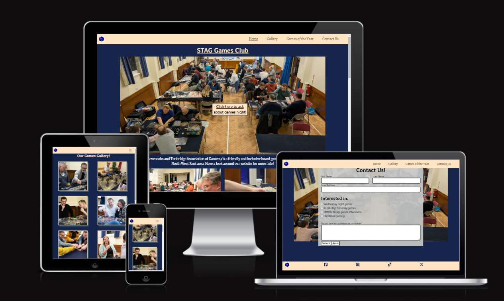
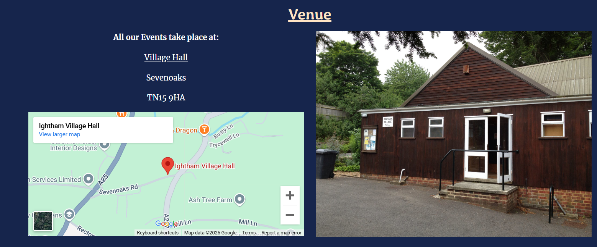
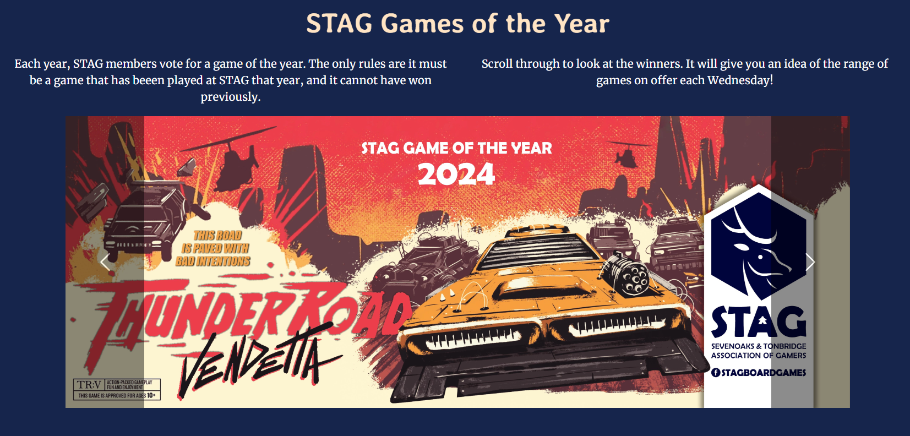
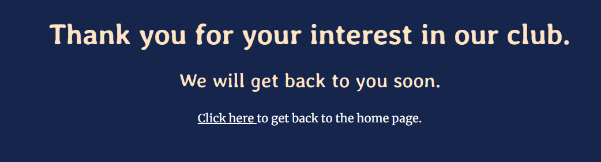

# Stag Board Games Club Website #

The Stag Board Games Club website has two main purposes. It aims to attract new members to the club by providing clear and factual information about club events, portray the welcoming and inculsive atmosphere of the club and allow for an easy method to contact a club representative with any questions. It also aims to cater for current members who want to see up-to-date photos from recent events, find out more information about future events and research popular games.

The target audience of the website is both potential new members and current members. It will be useful for finding out information about club events, contacting club representatives and gaining an insight into what an experience would be like if attending a club event.

## Features ##
The website includes a number of features to reach the aims of encourages new members and supporting current members.

### Navbar ###
The navbar includes a number of features to aid user experience:
- Responsiveness at different screen sizes to use space appropriately.
- Clear naming of different pages within the site to allow of ease of use between pages.
- A logo to help brand the club and navigate to the homepage.
- Underlined text to indicate the page a user is currently on.
- A change in text colour when a mouse if hovered over a link to explain clearly what will happen when the link is clicked.

### Introduction and 'Hero' image ### 
The first feature of the main section is a large image of a number of people at a club night and a button as a 'call to action' for new members to find out more. This busy scene shows the club in a positive light for any users one their first viewing of the website. The button use a media query to position in front of the image in desktops to save space and ensure it can be seen in a prominent position, but sits beneath the images in smaller screens to avoid blocking the image.

### Information Section ###
The information section allows users to quickly and easily find out information about the club in order to easily attend events in the correct location. Images and a map have also been used to aid understanding.

### Testimonials Section ###
The testimonials section helps users to see the welcoming and inclusive nature of the club, making them feel at easy with attending events. Images of the speakers in this section make the testimonials personal to the user reading them.

### Gallery ### 
The purposes of the gallery are to give perspective members an idea of what happens at an event and for current members to look at photos from events they have attended. The following features aid these aims:
- Large, clear images, professionally taken.
- A responsive layout so that the images can be seen clearly on any screen size.
- A shadow effect to help the images stand out.

### Games of the Year ### 
The aim of this page is to allow users further insight into the sort of games played at the club. A carousel was used to allow the user to interact with the images of the games and look at them at their own speed. The scroll buttons were styled to increase accessibility. Each picture links to the Board Game Geek website to give the user more information about the game. Each link opens in a new tab to allow easy of navigation for the user.

### Contact Us ###
The contact us page displays a form for the user to fill in to connect with a club representative and find out more information. It includes the following features:
- Required elements of 'First Name', 'Last Name' and 'Email Address' in order that no important information is left out.
- Checkboxes to make clear the particular events users are interested in.
- A textarea element to give the user the chance to write an specific questions.
- Submit and reset buttons to aid user experience. The submit button navigates to a separate page to confirm the form has submitted successfully.
- A responsive design that positions the form on top of the image in desktop screens, but keeps it below the image on smaller screens.
Borders around fields to ensure accessibility.

### Footer ### 
The footer section contains links to social media, relevant for users looking to connect with the club. These links will open to a new tab to allow easy navigation. 

