# Stag Board Games Club Website #

The Stag Board Games Club website has two main purposes. It aims to attract new members to the club by providing clear and factual information about club events, portray the welcoming and inclusive atmosphere of the club and allow for an easy method to contact a club representative with any questions. It also aims to cater for current members who want to see up-to-date photos from recent events, find out more information about future events and research popular games.

The target audience of the website is both potential new members and current members. It will be useful for finding out information about club events, contacting club representatives and gaining an insight into what an experience would be like if attending a club event.

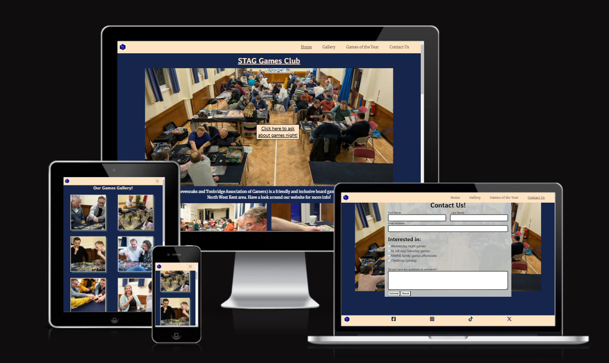
---
## User Stories #

### Must Have ###
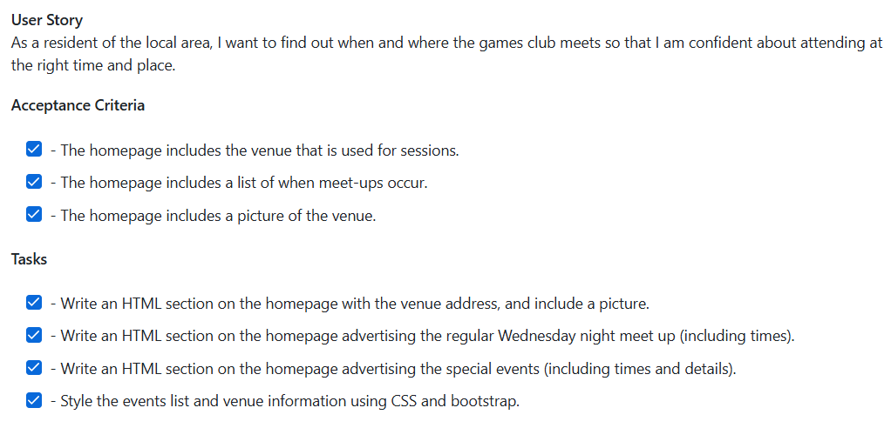

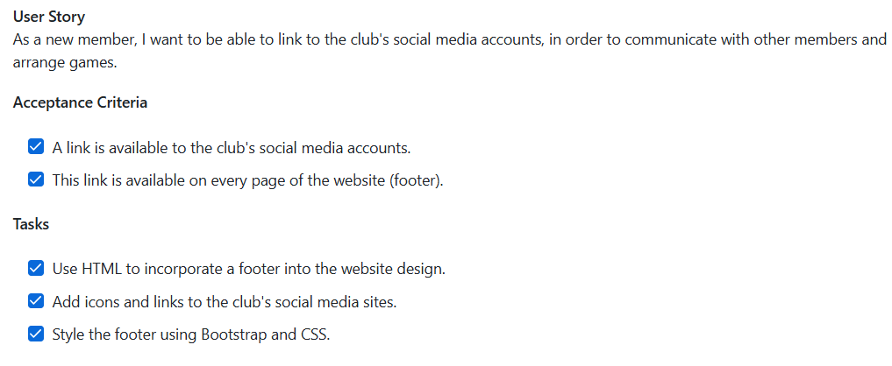

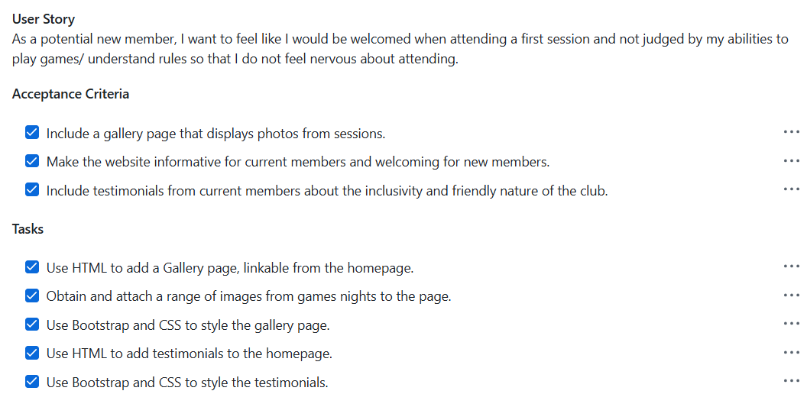

### Should Have ###

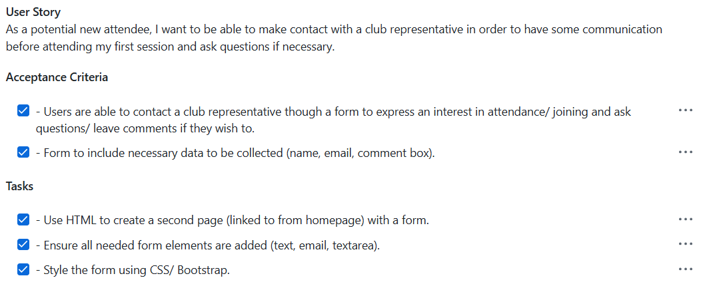

### Could Have ### 
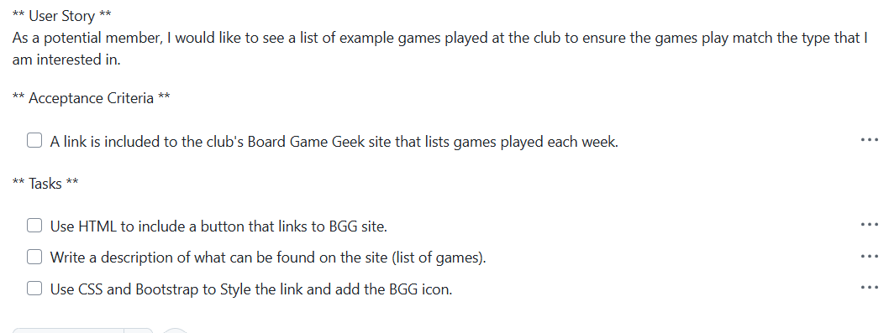

All the Must Have and Should Have user stories were completed. The Could Have user story was completed but the method to do this was altered. Instead of a list of games played on an average night, a carousel of the voted for 'Games of the Year' was included instead.

---
## Features ##
The website includes a number of features to reach the aims of encourages new members and supporting current members.

### Navbar ###
The navbar includes a number of features to aid user experience:
- Responsiveness at different screen sizes to use space appropriately.
- Clear naming of different pages within the site to allow of ease of use between pages.
- A logo to help brand the club and navigate to the homepage.
- Underlined text to indicate the page a user is currently on.
- A change in text colour when a mouse if hovered over a link to visually indivate what will happen when the link is clicked.
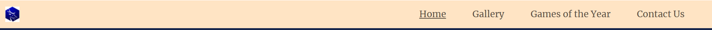
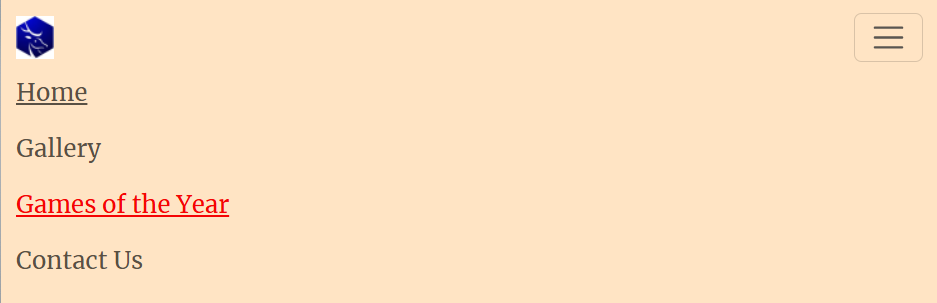

### Introduction and 'Hero' image ### 
The first feature of the main section is a large image of a number of people at a club night and a button as a 'call to action' for new members to find out more. This busy scene shows the club in a positive light for any users one their first viewing of the website. The button uses a media query to position in front of the image in desktops to save space and ensure it can be seen in a prominent position, but sits beneath the images in smaller screens to avoid blocking the image.
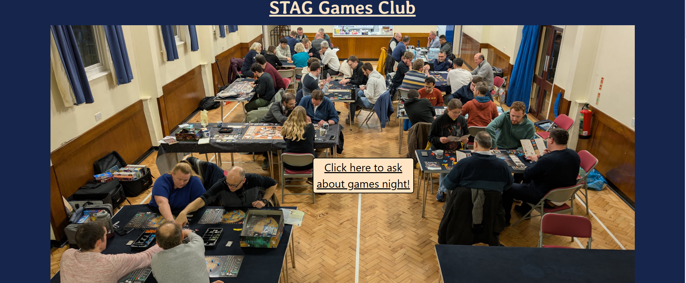
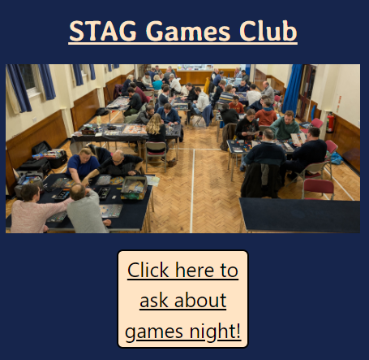

### Information Section ###
The information section allows users to quickly and easily find out information about the club in order to easily attend events in the correct location. Images and a map have also been used to aid understanding.
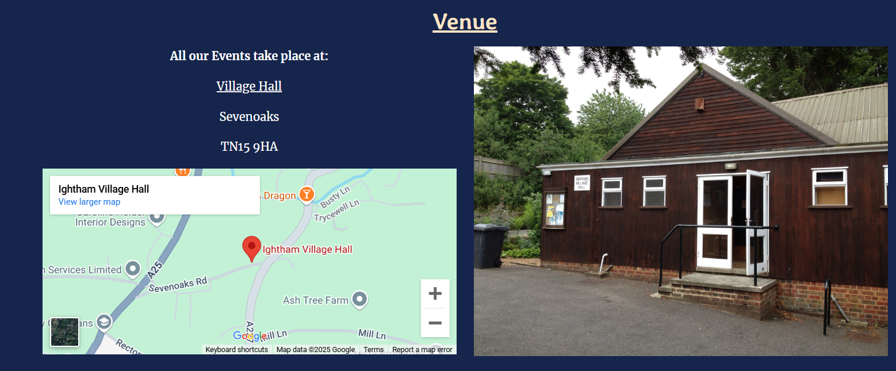

### Testimonials Section ###
The testimonials section helps users to see the welcoming and inclusive nature of the club, making them feel at easy with attending events. Images of the speakers in this section make the testimonials personal to the user reading them.
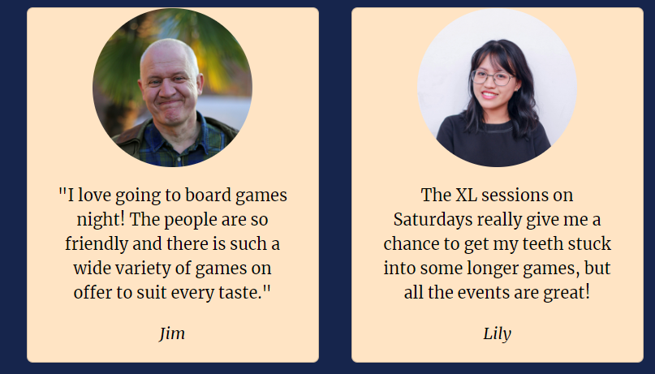

### Gallery ### 
The purposes of the gallery are to give perspective members an idea of what happens at an event and for current members to look at photos from events they have attended. The following features aid these aims:
- Large, clear images, professionally taken.
- A responsive layout so that the images can be seen clearly on any screen size.
- A shadow effect to help the images stand out.

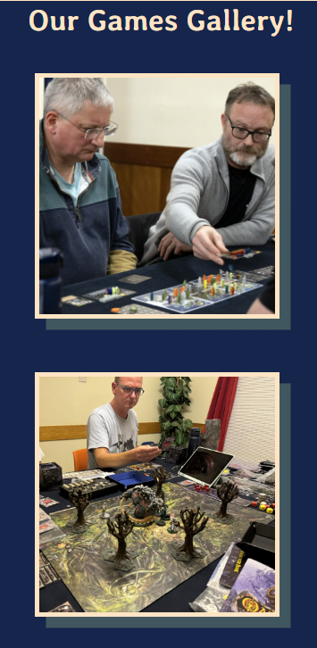
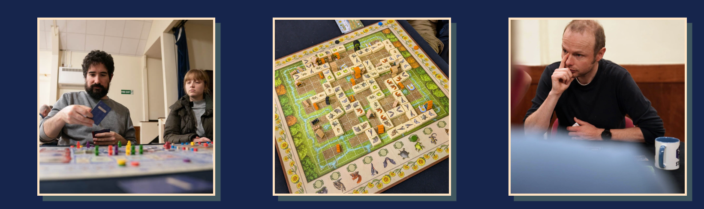

### Games of the Year ### 
The aim of this page is to allow users further insight into the sort of games played at the club. A carousel was used to allow the user to interact with the images of the games and look at them at their own speed. The scroll buttons were styled to increase accessibility. Each picture links to the Board Game Geek website to give the user more information about the game. Each link opens in a new tab to allow easy of navigation for the user.

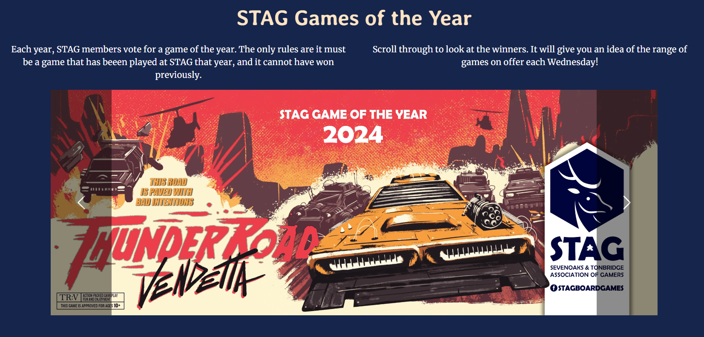

### Contact Us ###
The contact us page displays a form for the user to fill in to connect with a club representative and find out more information. It includes the following features:
- Required elements of 'First Name', 'Last Name' and 'Email Address' in order that no important information is left out.
- Checkboxes to make clear the particular events users are interested in.
- A textarea element to give the user the chance to write an specific questions.
- Submit and reset buttons to aid user experience. The submit button navigates to a separate page to confirm the form has submitted successfully.
- A responsive design that positions the form on top of the image in desktop screens, but keeps it below the image on smaller screens.
Borders around fields to ensure accessibility.

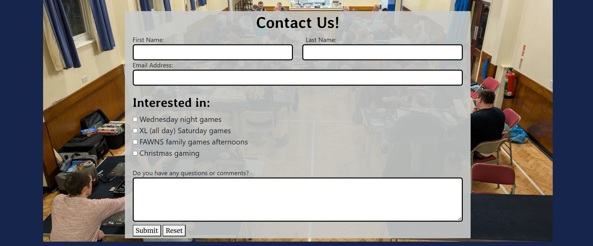
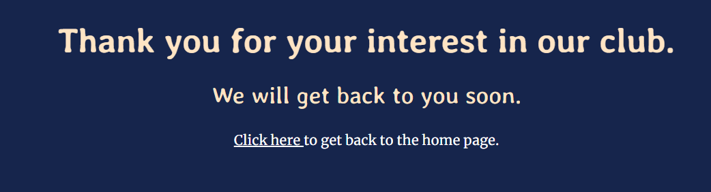

### Footer ### 
The footer section contains links to social media, relevant for users looking to connect with the club. These links will open to a new tab to allow easy navigation. 

---

### Features Left to Implement ###
The site could benefit from the following features in the future:
-A page used for write-ups of events. This already exists in the club's social media and could easily be transfered to the page.
-A 'members area' to allow current members to arrange meet-ups and discuss games played.

---

## Testing ## 
- The website has been tested in different browsers: Chrome, Edge, Safari.
- The project is responsive and functions on all standard screen sizes, using Dev Tools device toolbar.

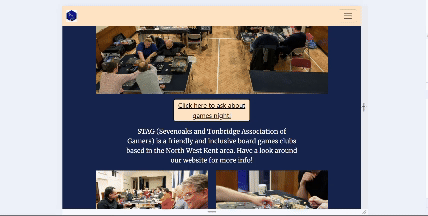

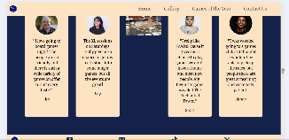

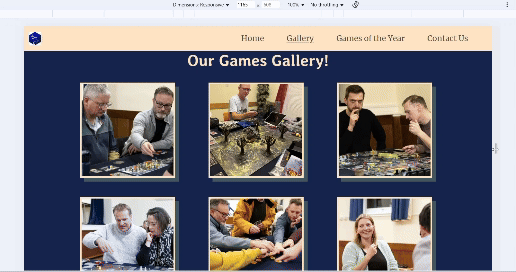

- The text in all pages is readable and easy to understand. Lighthouse was used to check for accessibiliy, including colour clashes.
- The form has been tested, requires entries in the 'First Name', 'Last Name' and 'Email' fields, and the 'Email' field will only accept a recognised email address. The submit button navigates to a confirmation page and the reset button works.
- All external links work and are open in new tabs.
- Internal links and buttons all work.

### Bugs ### 
- TBC

### Validation ###
- HTML was validated using....
- CSS was validated using...
- Accessibility was checked using...
---
## Deployment ##
This section describes the process required to deploy this project using GitHub.
- Go to the Settings tab of your GitHub repo.
- On the left-hand sidebar, in the Code and automation section, select Pages.
  - Make sure:
    - Source is set to 'Deploy from Branch'.
    - Main branch is selected.
    - Folder is set to / (root).
- Under Branch, click Save.
- Go back to the Code tab. Wait a few minutes for the build to finish and refresh your repo.
- On the right-hand side, in the Environments section, click on 'github-pages'.
Click View deployment to see the live site.

The live site can be found here:
- https://andrewpmilne.github.io/project-one-stag-games-club/
---
## Credits ##
The following sites were used to assist with the project:
- https://getbootstrap.com/ (linked in the HTML code to aid design and responsiveness).
- https://fontawesome.com/ (linked in the HTML code for social media icons).
- https://fonts.google.com/ (to source the fonts used for the project).
- https://stackoverflow.com/ (for assistance with code-related queries).
- https://www.w3.org/ (for guides and tutorials with specific code).
- https://www.youtube.com/kevinpowell (for guidance with CSS, specifcally flexbox).
---
## Media ##
- Most images were taking with permission from David Fox, co-ordinator of the STAG board games club.
- Images for the testimonials section were taking from https://www.pexels.com/
---
## Thanks ## 
I'd like to thank:
- My mentor, Juliia Konovalova for Slack calls and lots of constructive criticism!
- The Code Institute tutors, Rebecca and Oisin, for helping to solve a few technical issues.
- David Fox, co-ordinator of the STAG board games club, for moral support and providing images and logos. 